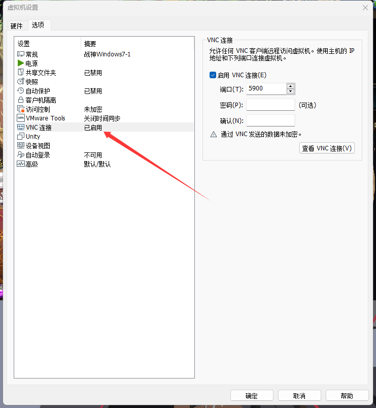
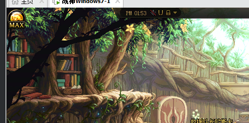
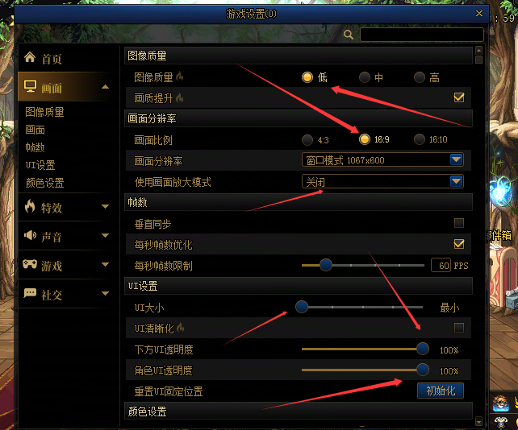
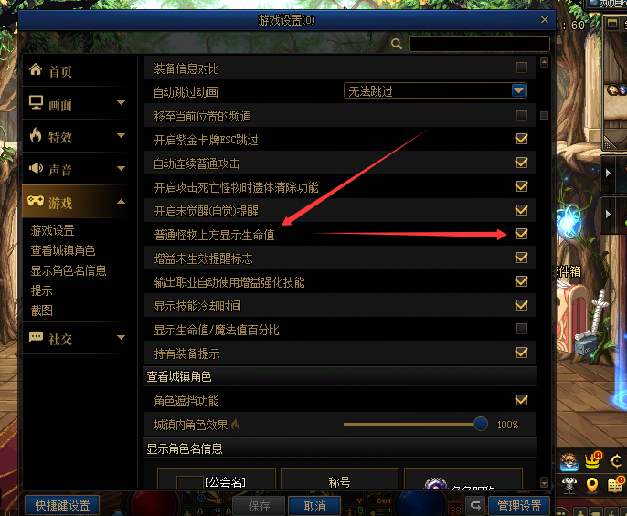
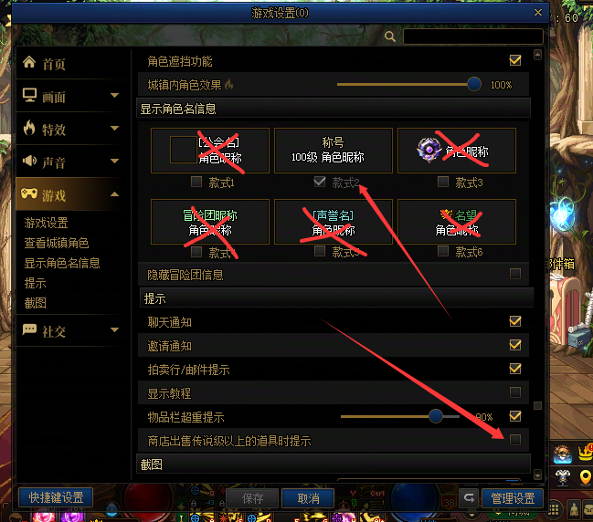
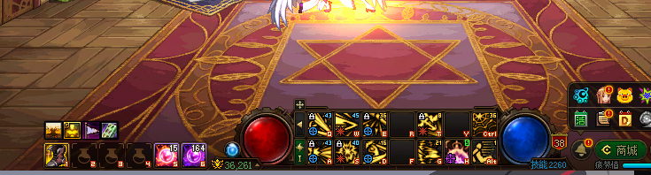
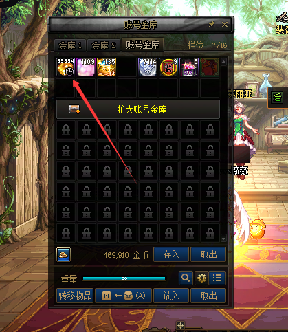
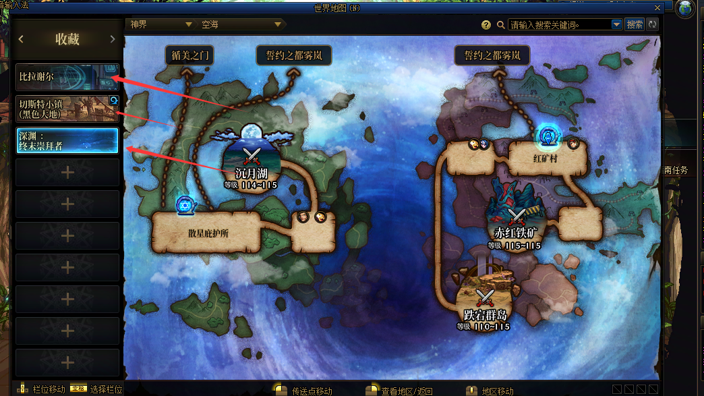
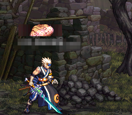

# automatic-painting

#### 介绍

1111111111

#### 软件架构

软件架构说明

#### 安装教程

1. xxxx
2. xxxx
3. xxxx

#### 使用说明

1. 需要VMware虚拟机win7系统，开启vnc 
    
2. 游戏窗口开启磁吸放置到左上角，并锁定窗口 
    
3. 游戏设置好 
    
    
    
4. alt的位置放个后跳，以识别技能状态，有没有释放完毕。ctrl放能击杀b0ss的技能，打深渊的话快捷物品1还是快捷物品2放红药 
    
5. 刷风暴逆鳞需要把金绿放第一格 
    
6. 传送阵设置 
    
7. 角色称号设置成基础达标者 
    
8. 游戏一键聚物键为tab,回赛利亚房间键为delete
9. app.py为程序入口 
10. app_server.py为跑yolo、paddleocr的程序入口 
